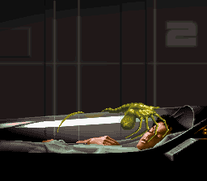
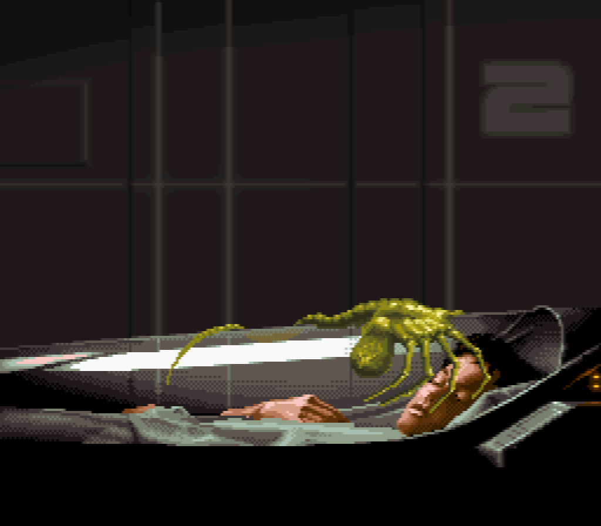
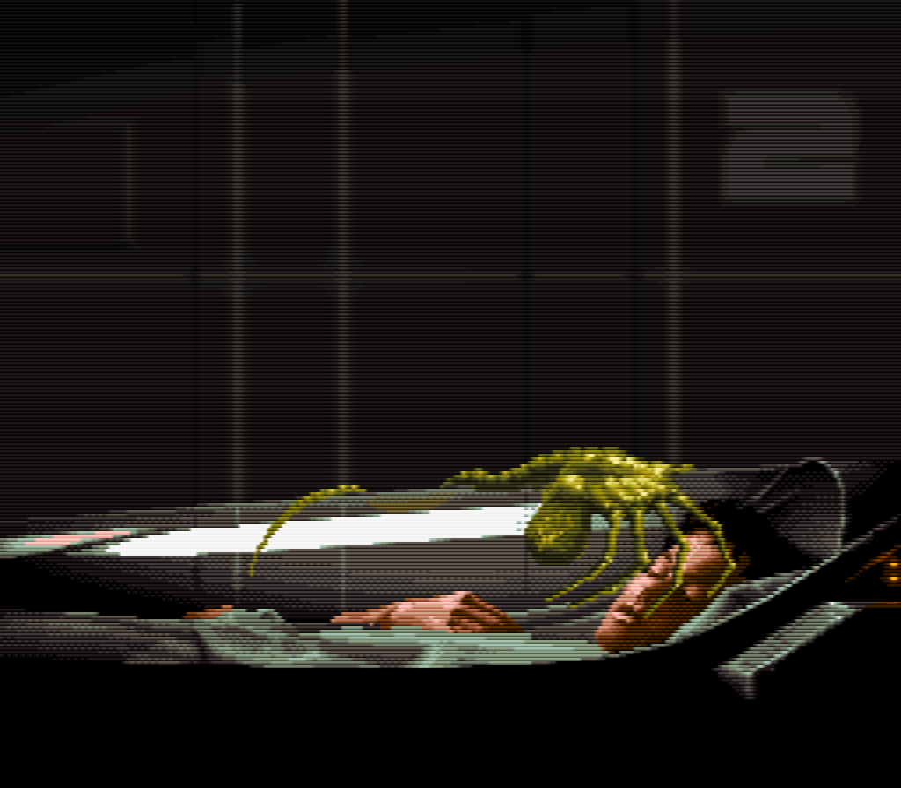

<!-- README.md is generated from README.Rmd. Please edit that file -->

# Ole Ivar Rudi’s CRT scanline method

## Intro

-   I stumbled upon Ole’s [original
    tweet](https://twitter.com/oleivarrudi/status/895665025251123201?s=20)
    and thought it looked super cool!
-   So here is my (hopefully accurate) recreation of it using the
    [ImageMagick STL](https://www.imagemagick.org/Magick++/STL.html)
    through the R `{magick}` package
    -   I’m not sure if all details are exactly the same - but I’m
        really happy with the output this produces
-   AS Ole says

> Of course, this is a completely technically wrong and unscientific way
> of doing it, but it gets the iidea across far better than the industry
> standard way of just adding black lines for every second vertical
> pixel, which darkens the image too much imo

## Read original image

-   Read a SNES image at its original resolution (256w x 224h pixels)

``` r
library(magick)

i <- image_read('original.png')
i
```



## Rescale image

-   Extract the width and height as variables
-   Then scale the image in two steps
    1.  Scale 4x vertically using the `point` filter ([which I believe
        is the same as ‘nearest
        neighbour’?](https://legacy.imagemagick.org/Usage/filter/#point))
    2.  Scale 4x horizontally using the `triangle` filter ([which I
        believe is similar to
        bilinear?](https://legacy.imagemagick.org/Usage/filter/#triangle))
        *to replicate that CRT scanline horizontal smudge feel*

``` r
w <- image_info(i)$width
h <- image_info(i)$height

i_scaled <-
    image_resize(i, geometry = paste0(w, 'x', h*4, '!'), filter = "point") |> 
    image_resize(geometry = paste0(w*4, 'x', h*4, '!'), filter = "triangle")

i_scaled
```



## Create scanline pattern

-   As per Ole’s recipe, I create a 4 pixel height scanline pattern
    -   *2 clear pixels, one half transparent pixel and one black pixel*

``` r
x <- c(
    rgb(255, 255, 255, 000, maxColorValue = 255), # 100% transparent white
    rgb(255, 255, 255, 000, maxColorValue = 255), # 100% transparent white
    rgb(000, 000, 000, 128, maxColorValue = 255), # 50% transparent black
    rgb(000, 000, 000, 255, maxColorValue = 255)  # opaque black
    )

sl_filter <-
    rep(x, length.out = h*4) |> 
    rep(each = w*4) |> 
    matrix(ncol = w*4, nrow = h*4, byrow = TRUE) |> 
    image_read()
```

## Layer the scanline pattern

-   Then layer the scanline pattern using the `SoftLight` operator

``` r
out <- image_composite(i_scaled, sl_filter, operator = "SoftLight")
out
```



## Save outputs

-   Save the output at full resolution for inspection

``` r
image_write(i_scaled, 'original_scaled.png')
image_write(out, 'original_scanlined.png')
```
